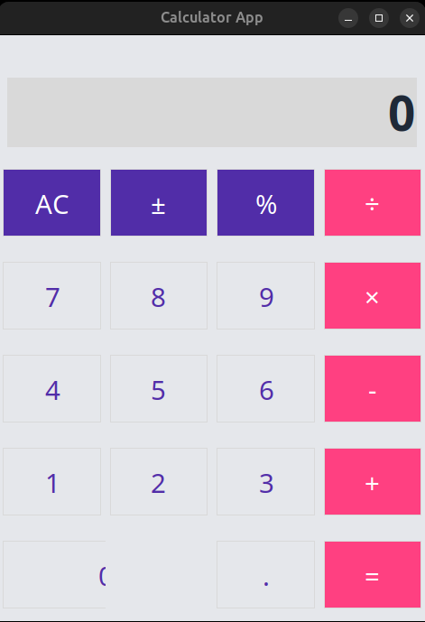

# 🧮 Calculator App (Tkinter)

A modern, responsive calculator built using **Python's Tkinter GUI library**.  
This app mimics the basic functionality and design of a standard calculator — featuring arithmetic operations, percentage handling, sign switching, and a clean user interface.

---

## ✨ Features
- 🧾 **Basic operations:** Addition, subtraction, multiplication, division  
- 💯 **Percentage** and **sign toggle (±)** support  
- 🎨 **Modern UI:** Custom colors and typography using `Inter` font  
- ⚡ **Keyboard-like layout** with grid-based responsive design  
- 🚫 **Error handling** for invalid expressions and division by zero  

---

## 🖥️ Preview



---

## ▶️ How to Run
Make sure Python is installed on your system (version 3.7+ recommended).

```bash
python calculator.py
```
The calculator window should open immediately.

---

## 📁 Project Structure

```bash
calculator/
├── LICENSE            # MIT License file
├── calculator.py      # Main Tkinter GUI app
└── README.md          # Project documentation
```

---

## 🧩 Tech Stack

- Language: Python
- GUI Library: Tkinter (built-in)

---

## ⚖️ License

This project is licensed under the [MIT License](LICENSE).

---

## 🧑‍💻 Author

[**Subhanki Sahoo**](https://github.com/subhanki0108)
